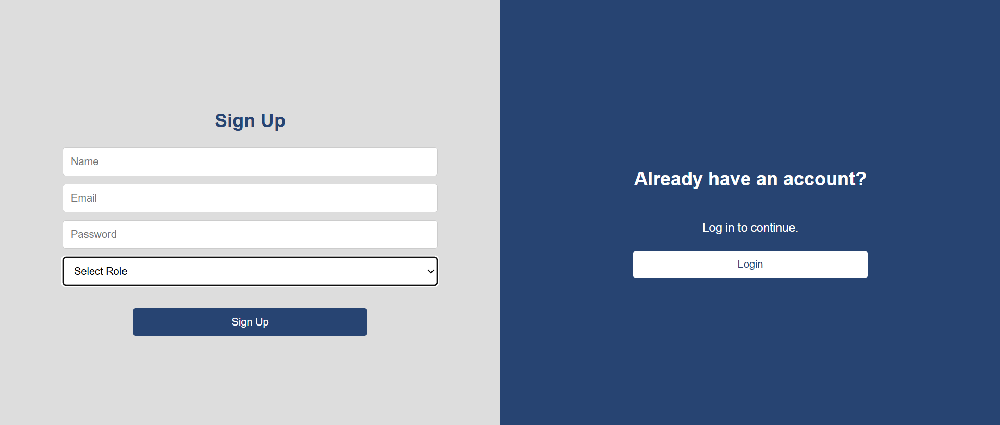

<h1>UWACU Project</h1>

<h2>Introduction</h2>

Uwacu is a platform that bridges Rwanda's cultural heritage with the next generation, creating job opportunities while inspiring national pride. It reconnects Rwandan youth and the diaspora with their roots through interactive sessions, competitions, and cultural games, fostering a deep sense of identity in a globalized world. The platform enables users to not only learn but also teach, creating meaningful employment opportunities and building a sustainable, community-driven ecosystem for cultural education.

<h3>My Inspiration and Challenges</h3>

I’ve always wanted to play a musical instrument like the guitar. One day as i was thinking about this and thought to myself, ‘how great would it be if i learned playing inanga (the traditional rwandan "harp") instead?’ That’s how this idea was born. It grew into something bigger—a cultural tool to connect the youth to our heritage, strengthen our national bond, and celebrate our pride.

Throughout the development of Uwacu, I faced two significant challenges. Firstly, I had a very limited timeframe to complete the project. This required me to prioritize features and work efficiently. Secondly, I needed to learn several new frameworks while simultaneously working on the project. This involved a lot of on-the-fly learning and problem-solving, which was both challenging and rewarding. I had to dedicate extra time to learn the ins and outs of [**Mention specific frameworks, e.g., React, Django, etc.**].

Despite the time constraints and the learning curve, I'm proud of the result. I learned valuable lessons about time management, rapid framework acquisition, and building a functional application under pressure.

<h3>Technical Details</h3>
    
Uwacu is built using a modern web stack. The front-end is developed using React, providing a dynamic and responsive user interface. The back-end API will be built using Flask Framework, which handles data management and communication with the front-end
    

<h4>React Frontend Details</h4>

The React frontend is structured as a Single Page Application (SPA), providing a seamless user experience. I utilized React's component-based architecture to create reusable UI elements, improving maintainability and development speed. For routing, I implemented React Router, enabling client-side navigation without full page reloads. For styling, we used CSS, which allowed us to create a consistent and visually appealing design.

<h3>Key Features:</h3>

<ul>
    <li><strong>Learning:</strong> Provides educational resources and tutorials to help users learn new skills or gain knowledge related the Rwandan culture.</li>
    <li><strong>Shop:</strong> Enables users to browse, purchase, or sell products that enhance learning and/or create Rwandan culture appreciation</li>
    <li><strong>Community:</strong> Fosters a sense of community through forums, discussions, or social features, allowing users to connect and interact.</li>
</ul>

<strong>Deployed Site:</strong> <a href="https://benjah05.github.io/uwacu_landing_page/">uwacu</a>

<strong>Final Project Blog Article:</strong> <a href="https://medium.com/building-uwacu">Building Uwacu</a>

<strong>Author(s):</strong>

<ul>
    <li>SENZELE Benjamine - <a href="https://www.linkedin.com/in/benjamine-senzele/">LinkedIn</a></li>
</ul>

<h2>Installation</h2>

<ol>
    <li><strong>Clone the repository:</strong>
    <pre><code>git clone https://github.com/benjah05/uwacu</code></pre></li>
    <li><strong>Navigate to the project directory:</strong>
    <pre><code>cd uwacu</code></pre></li>
</ol>

<h2>⚙️ Usage</h2>

<h3>Creating an Account:</h3>
    <ol>
      <li>Navigate to the Uwacu website by clicking <a href="https://benjah05.github.io/uwacu_landing_page/">here</a>.</li>
      <li>Click on the "Sign Up" or "Register" button, usually located in the top right corner of the page.</li>
      <li>You will be presented with a registration form. Fill in the required information:
          <ul>
              <li><strong>Username:</strong> Choose a unique username.</li>
              <li><strong>Email Address:</strong> Enter your valid email address.</li>
              <li><strong>Password:</strong> Create a strong password.</li>
          </ul>
      </li>
      <li>Read and accept the Terms of Service and Privacy Policy (if applicable).</li>
      <li>Click the "Submit" or "Register" button to create your account.</li>
      <li>You may receive a verification email. Check your inbox and click the verification link to activate your account.</li>
      <li>Once your account is activated, you can log in using your username/email and password.</li>
    </ol>
    

<h2>Contributing</h2>

<ol>
    <li>Fork the repository.</li>
    <li>Create a new branch:</li>
    <pre><code>git checkout -b feature/your-feature-name</code></pre>
    <li>Commit changes:</li>
    <pre><code>git commit -m "Add your feature or fix"</code></pre>
    <li>Push to fork:</li>
    <pre><code>git push origin feature/your-feature-name</code></pre>
    <li>Submit pull request.</li>
</ol>

<h2>💻 Related Projects</h2>

<ul>
    <li><a href="https://edu.google.com/">Google Classroom</a></li>
    
Google Classroom allows teachers to upload lessons, assignments, and resources for students to access.
    Google Classroom is a general-purpose tool for all types of education.
    

    <li><a href="https://afrocrowd.org/">AfroCrowd</a></li>
    
AfroCrowd aims to preserve and promote African culture and history.
    It focuses on crowdsourced content rather than structured learning.

</ul>

<h2>🪪 Licensing</h2>

All Rights Reserved. This is a personal project, and no license is granted for use or distribution.
